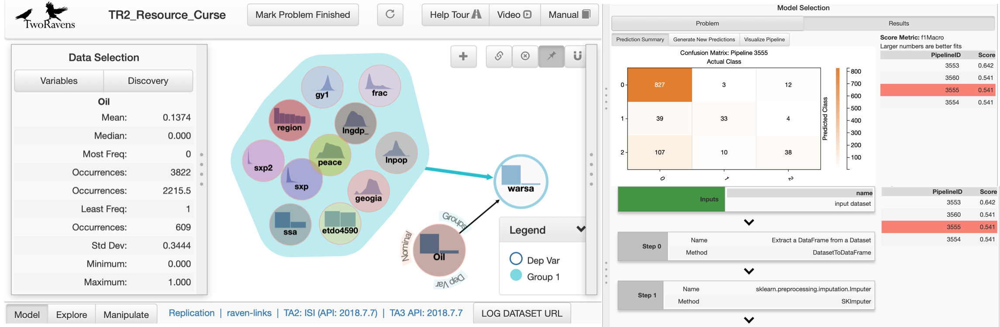

[

**TwoRavens** is a system of interlocking statistical tools for data exploration, analysis, and meta-analysis.  The first to be released is an interface for quantitative analysis, that allows users at all levels of statistical expertise to explore their data, describe their substantive understanding of the data, and appropriately construct statistical models. This integrates with Dataverse ([Project](http://dataverse.org)|[GitHub](https://github.com/IQSS/dataverse)) and Zelig ([Project](http://zeligproject.org)|[GitHub](https://github.com/IQSS/Zelig)), through a portable, lightweight, browser-based and gesture-driven interface, allowing users to run statistical models available in Zelig on data archived in Dataverse.

### Project page and publications 
 - Available at: [http://2ra.vn](http://2ra.vn)
 
### Demo

 - To demo TwoRavens using replication data from Fearon and Laitin's 2003 article, *Ethnicity, Insurgency, and Civil War*:
https://beta.dataverse.org/dataexplore/gui.html?dfId=37&

   

### Event Data
This is a part of the broader TwoRavens project featuring tools for subsetting and aggregating event data. More information can be found [here](doc_out/eventdata_docs_out/index.html).

### Architecture
More information about the architecture of TwoRavens is available [here](doc_out/arch_docs_out/index.html).
