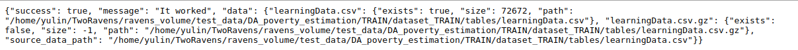

D3M Configuration
=================

This application constructs the web page you can see. It will generate url based on your operation and pass it to the **View** component.
After that, **View** will execute corresponding logic code based on the input urls.

URL Patterns
============

All acceptable url patterns (in regex) are presented below:

---

**Pattern**: d3m-config/list

&nbsp;&nbsp;&nbsp;&nbsp;&nbsp;&nbsp;Return a HTML page shows the list of available D3M configuration, rendered by [this](https://github.com/TwoRavens/TwoRavens/blob/master/tworaven_apps/configurations/templates/d3m_config_list.html).

* **View Func**: view_d3m_list(request)
---

**Pattern**: d3m-config/details/(?P<d3m_config_id>\d{1,5})

&nbsp;&nbsp;&nbsp;&nbsp;&nbsp;&nbsp;Not implemented yet, return a TODO page.

* **View Func**: view_d3m_details_page(request, d3m_config_id)

---

**Pattern**: d3m-config/details/json/(?P<d3m_config_id>\d{1,5})

&nbsp;&nbsp;&nbsp;&nbsp;&nbsp;&nbsp;Return a JSON string that contains detailed information for given D3M configuration ID.

* **View Func**: view_d3m_details_json(request, d3m_config_id)

---

**Pattern**: d3m-config/json/latest

&nbsp;&nbsp;&nbsp;&nbsp;&nbsp;&nbsp;Return a JSON string that contains detailed information for the last modified D3M configuration.

* **View Func**: view_d3m_details_json_latest(request, as_eval_dict=False)

---

**Pattern**: d3m-config/json/eval/latest

&nbsp;&nbsp;&nbsp;&nbsp;&nbsp;&nbsp;Return a JSON string that contains detailed information for the last modified D3M configuration. A wrapper function for *view_d3m_details_json_latest(request, True)*

* **View Func**: view_d3m_details_json_eval_latest(request)

---

**Pattern**: d3m-config/get-dataset-schema/json

&nbsp;&nbsp;&nbsp;&nbsp;&nbsp;&nbsp;Return a JSON string that presents the dataset schema of given D3M configuration id.

* **View Func**: view_get_dataset_schema(request, d3m_config_id=None)

---

**Pattern**: d3m-config/get-dataset-schema/json/(?P<d3m_config_id>\d{1,5})

&nbsp;&nbsp;&nbsp;&nbsp;&nbsp;&nbsp;Same function as *view_get_dataset_schema* with specific configuration id.

* **View Func**: view_get_dataset_schema(request, d3m_config_id=*d3m_config_id*)

---

**Pattern**: d3m-config/get-problem-schema/json/(?P<d3m_config_id>\d{1,5})

&nbsp;&nbsp;&nbsp;&nbsp;&nbsp;&nbsp;Return a JSON string that presents the problem schema. Configuration ID is optional.

* **view_get_problem_schema** (request, d3m_config_id=None)

* **Parameters**:
    * **request** (*Django.http.HttpRequest*):  Http request received, it's naturally handled by Django framework.
    * **d3m_config_id** (*String*):             A string that indicates a D3M configuration ID.

* **Example**:

---

**Pattern**: d3m-config/get-problem-data-file-info/(?P<d3m_config_id>\d{1,5})

&nbsp;&nbsp;&nbsp;&nbsp;&nbsp;&nbsp;Return a JSON string that describes the information of training data and target files, if they exist. Configuration ID is optional.

* **view_get_problem_data_info** (request, d3m_config_id=None)

* **Parameters**:
    * **request** (*Django.http.HttpRequest*):  Http request received, it's naturally handled by Django framework.
    * **d3m_config_id** (*String*):             A string that indicates a D3M configuration ID.

* **Example**:

