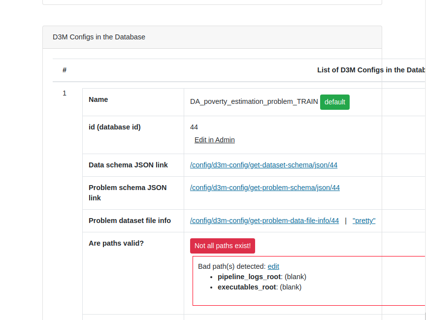
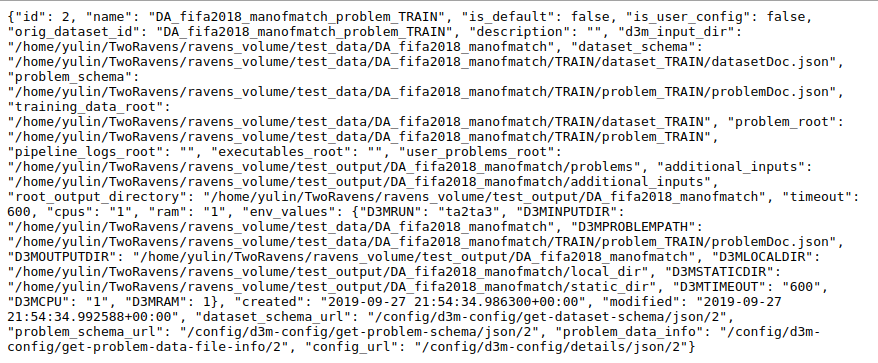
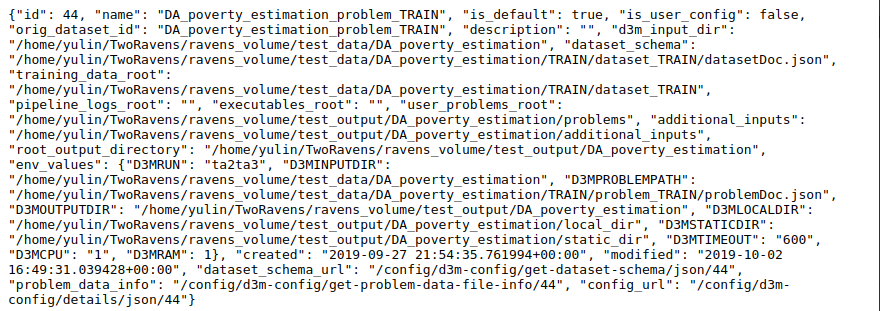
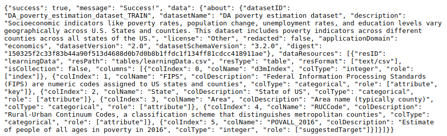
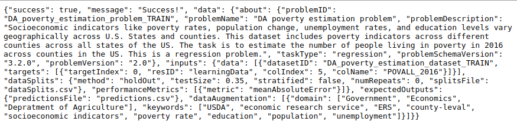
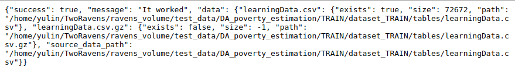

D3M Configuration
=================

This application is the core component of our D3M interface. It stores several crucial configuration about the dataset and task.. It will generate url based on your operation and pass it to the **View** component.
After that, **View** will execute corresponding logic code based on the input urls.

URL Patterns
============

All acceptable url patterns (in regex) are presented below:
* [d3m-config/list](#d3m_config_list)
* [d3m-config/details/?](#d3m_config_details)
* [d3m-config/details/json/?](#d3m_config_details_json)
* [d3m-config/json/latest](#d3m_config_json_latest)
* [d3m-config/json/eval/latest](#d3m_config_json_eval_latest)
* [d3m-config/get-dataset-schema/json/?](#d3m_config_dataset_schema_json)
* [d3m-config/get-problem-schema/json/?](#d3m_config_problem_schema_json)
* [d3m-config/get-problem-data-file-info/?](#d3m_config_problem_data_json)

where '?' denotes optional extra pattern, please refer to corresponding section for detailed information.

---

**Pattern**: d3m-config/list 

&nbsp;&nbsp;&nbsp;&nbsp;&nbsp;&nbsp;Return a HTML page shows the list of available D3M configuration, rendered by [this](https://github.com/TwoRavens/TwoRavens/blob/master/tworaven_apps/configurations/templates/d3m_config_list.html).

* **view_d3m_list** (request)

* **Parameters**:
    * **request** (*Django.http.HttpRequest*):  Http request received, it's naturally handled by Django framework.

* **Example**:

---

**Pattern**: d3m-config/details/(?P<d3m_config_id>\d{1,5}) 

&nbsp;&nbsp;&nbsp;&nbsp;&nbsp;&nbsp;Not implemented yet, return a TODO page.

* **view_d3m_details_page** (request, d3m_config_id)

NOT IMPLEMENTED

---

**Pattern**: d3m-config/details/json/(?P<d3m_config_id>\d{1,5}) 

&nbsp;&nbsp;&nbsp;&nbsp;&nbsp;&nbsp;Return a JSON string that contains detailed information for given D3M configuration ID.

* **view_d3m_details_json** (request, d3m_config_id)

* **Parameters**:
    * **request** (*Django.http.HttpRequest*):  Http request received, it's naturally handled by Django framework.
    * **d3m_config_id** (*String*):             A string that indicates a D3M configuration ID.

* **Example**:

---

**Pattern**: d3m-config/json/latest 

&nbsp;&nbsp;&nbsp;&nbsp;&nbsp;&nbsp;Return a JSON string that contains detailed information for the last modified D3M configuration.

* **view_d3m_details_json_latest** (request, as_eval_dict=False)

* **Parameters**:
    * **request** (*Django.http.HttpRequest*):  Http request received, it's naturally handled by Django framework.
    * **as_eval_dict** (*Boolean*): A boolean flag that indicates whether convert the result as a dictionary.

* **Example**:

---

**Pattern**: d3m-config/json/eval/latest 

&nbsp;&nbsp;&nbsp;&nbsp;&nbsp;&nbsp;Return a JSON string that contains detailed information for the last modified D3M configuration. A wrap function for *view_d3m_details_json_latest(request, True)*

* **view_d3m_details_json_eval_latest** (request)

* **Parameters**:
    * **request** (*Django.http.HttpRequest*):  Http request received, it's naturally handled by Django framework.

* **Example**:

---

**Pattern**: d3m-config/get-dataset-schema/json/(?P<d3m_config_id>\d{1,5}) 

&nbsp;&nbsp;&nbsp;&nbsp;&nbsp;&nbsp;Return a JSON string that presents the dataset schema. Configuration ID is optional. Return the last schema if the id is not specified.

* **view_get_dataset_schema** (request, d3m_config_id=None)

* **Parameters**:
    * **request** (*Django.http.HttpRequest*):  Http request received, it's naturally handled by Django framework.
    * **d3m_config_id** (*String*):             A string that indicates a D3M configuration ID.

* **Example**:

---

**Pattern**: d3m-config/get-problem-schema/json/(?P<d3m_config_id>\d{1,5}) 

&nbsp;&nbsp;&nbsp;&nbsp;&nbsp;&nbsp;Return a JSON string that presents the problem schema. Configuration ID is optional. Return the last schema if the id is not specified.

* **view_get_problem_schema** (request, d3m_config_id=None)

* **Parameters**:
    * **request** (*Django.http.HttpRequest*):  Http request received, it's naturally handled by Django framework.
    * **d3m_config_id** (*String*):             A string that indicates a D3M configuration ID.

* **Example**:

---

**Pattern**: d3m-config/get-problem-data-file-info/(?P<d3m_config_id>\d{1,5}) 

&nbsp;&nbsp;&nbsp;&nbsp;&nbsp;&nbsp;Return a JSON string that describes the information of training data and target files, if they exist. Configuration ID is optional. Return the last info if the id is not specified.

* **view_get_problem_data_info** (request, d3m_config_id=None)

* **Parameters**:
    * **request** (*Django.http.HttpRequest*):  Http request received, it's naturally handled by Django framework.
    * **d3m_config_id** (*String*):             A string that indicates a D3M configuration ID.

* **Example**:

