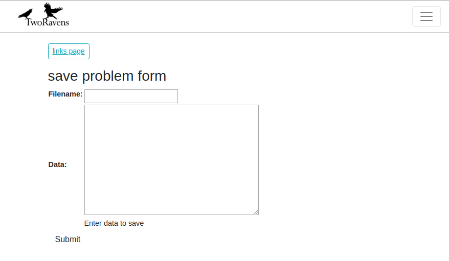
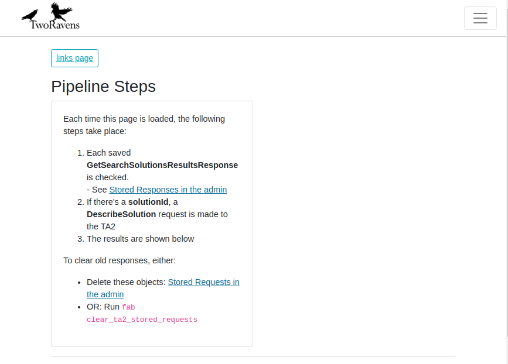

TA2 Interface
=================

This application plays the role of Back-end in our program. Namely, it handles the communication between remote TA2 server and process the response.. Different pages will be rendered based on the url received.

URL Patterns
============

All acceptable url patterns (in regex) are presented below (Most url pattern here should not be directly called, they are just part of other application):
* [store-problem-form](#store_problem_form)
* [store-user-problem](#store_user_problem)
* [get-problem-schema](#get_problem_schema)
* [debug-pipeline-steps](#debug_pipeline_steps)
* [retrieve-output-data](#retrieve_output_data)
* [download-file](#download_file)
* [retrieve-output-confusion-data](#retrieve_output_confusion_data)
* [retrieve-output-EFD-data](#retrieve_output_EFD_data)
* [stored-request/?](#stored_request)
* [stored-response/?](#stored_response)
* [view-grpc-search-history-json/?](#view_grpc_search_history)
* [view-grpc-stored-history/?](#view_grpc_stored_history)
* [clear-grpc-stored-history](#clear_grpc)

where '?' denotes optional extra pattern, please refer to corresponding section for detailed information.

---

**Pattern**: store-problem-form 

&nbsp;&nbsp;&nbsp;&nbsp;&nbsp;&nbsp;Return a web page that the user can submit the problem form

* **view_save_problem_form** (request)
* **Location**: views_user_problem.py

* **Parameters**:
    * **request** (*Django.http.HttpRequest*):  Http request received, it's naturally handled by Django framework.

* **Example**:

---

**Pattern**: store-user-problem 

&nbsp;&nbsp;&nbsp;&nbsp;&nbsp;&nbsp;Send a HttpRequest that contains a json string that describes user-defined problem.

* **view_save_problem_form** (request)
* **Location**: views_user_problem.py

* **Parameters**:
    * **request** (*Django.http.HttpRequest*):  Http request received, must contains a body that describes a user-specified problem.

---

**Pattern**: get-problem-schema 

&nbsp;&nbsp;&nbsp;&nbsp;&nbsp;&nbsp;Return a web page that describes the problem schema. (BUG)

* **view_get_problem_schema** (request)
* **Location**: views_additional.py

* **Parameters**:
    * **request** (*Django.http.HttpRequest*):  Http request received, it's naturally handled by Django framework.

---

**Pattern**: debug-pipeline-steps 

&nbsp;&nbsp;&nbsp;&nbsp;&nbsp;&nbsp;Return a web page that the user can submit the problem form

* **view_get_problem_schema** (request)
* **Location**: views_additional.py

* **Parameters**:
    * **request** (*Django.http.HttpRequest*):  Http request received, it's naturally handled by Django framework.

* **Example**:

---

**Pattern**: retrieve-output-data 

&nbsp;&nbsp;&nbsp;&nbsp;&nbsp;&nbsp;Return a web page presents the output of specific task

* **view_get_problem_schema** (request)
* **Location**: views_additional.py

* **Parameters**:
    * **request** (*Django.http.HttpRequest*):  Http request received, ust contain a body that specify the task id.

---

**Pattern**: download-file 

&nbsp;&nbsp;&nbsp;&nbsp;&nbsp;&nbsp;A http request to download a file

* **view_get_problem_schema** (request)
* **Location**: views_additional.py

* **Parameters**:
    * **request** (*Django.http.HttpRequest*):  Http request received, must contain the id of target file.

---

**Pattern**: retrieve-output-confusion-data 

&nbsp;&nbsp;&nbsp;&nbsp;&nbsp;&nbsp;Return a web page presents the confusion matrix of specific task

* **view_get_problem_schema** (request)
* **Location**: views_additional.py

* **Parameters**:
    * **request** (*Django.http.HttpRequest*):  Http request received, must contain the id of target task.

---

**Pattern**: retrieve-output-EFD-data 

&nbsp;&nbsp;&nbsp;&nbsp;&nbsp;&nbsp;Return a web page presents the EFD of specific task

* **view_get_problem_schema** (request)
* **Location**: views_additional.py

* **Parameters**:
    * **request** (*Django.http.HttpRequest*):  Http request received, must contain the id of target task.

---

**Pattern**: stored-request/(?P<hash_id>[\w]{40, 200}) 

&nbsp;&nbsp;&nbsp;&nbsp;&nbsp;&nbsp;Return a web page that shows the list of stored requests

* **view_get_problem_schema** (request)
* **Location**: views_saved_requests.py

* **Parameters**:
    * **request** (*Django.http.HttpRequest*):  Http request received, it's naturally handled by Django framework.

* **Example**:

None

---

**Pattern**: stored-response/(?P<hash_id>[\w]{40, 200}) 

&nbsp;&nbsp;&nbsp;&nbsp;&nbsp;&nbsp;Return a web page that shows the list of stored responses.

* **view_get_problem_schema** (request)
* **Location**: views_saved_requests.py

* **Parameters**:
    * **request** (*Django.http.HttpRequest*):  Http request received, it's naturally handled by Django framework.

---

**Pattern**: view-grpc-search-history-json/(?P<search_id>[\d]{1, 7}) 

&nbsp;&nbsp;&nbsp;&nbsp;&nbsp;&nbsp;Return a list of recent grpc search history in json format.

* **view_get_problem_schema** (request)
* **Location**: views_saved_requests.py

* **Parameters**:
    * **request** (*Django.http.HttpRequest*):  Http request received, it's naturally handled by Django framework.

---

**Pattern**: view-grpc-stored-history/(?P<search_id>[\d]{1, 7}) 

&nbsp;&nbsp;&nbsp;&nbsp;&nbsp;&nbsp;Return a list of recent grpc search history in json format.

* **view_get_problem_schema** (request)
* **Location**: views_saved_requests.py

* **Parameters**:
    * **request** (*Django.http.HttpRequest*):  Http request received, it's naturally handled by Django framework.

* **Example**:

None

---

**Pattern**:clear-grpc-stored-history 

&nbsp;&nbsp;&nbsp;&nbsp;&nbsp;&nbsp;Clear the grpc history

* **view_get_problem_schema** (request)
* **Location**: views_saved_requests.py

* **Parameters**:
    * **request** (*Django.http.HttpRequest*):  Http request received, it's naturally handled by Django framework.
