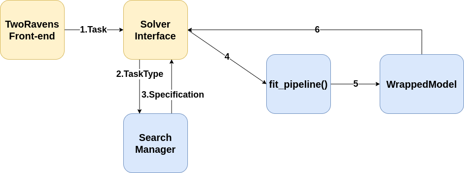

TwoRavens Solver
==================

The TwoRavens Solver is an efficient autoML solver that provides quick and simple solutions for the given task.
Currently, it supports Classification, Regression and Forecasting ML tasks. 
This documentation describes the workflow our solver and some crucial function signatures.

# Workflow

Noted that two yellow blocks belong to front-end while the rest blue blocks belong to this solver.

# Core Components
Generally speaking, we have three core components in our implementation. 
They are **ModelWrapper**, **SearchManager** and **fit_pipeline()**.
Noted that the first two are classes while the last one is a function, which will be called by our TwoRavens front-end.

## ModelWrapper
In order to be consistent with our TA3, the trained model must has same function signature as other TA2 system.
Since our models are implemented using different package (e.g. Sklearn, statmodel, pytorch etc.), they have to be wrapped.

> **note**
>
> -   You have to add new **ModelWrapper** if new packages are used for your model.

Below is the list of functions that need to be implemented:
* **predict**(pandas.DataFrame: *input_frame*) -> pandas.DataFrame: *output_frame*
    * given a dataframe, generate corresponding prediction (Classification & Regression tasks)               
* **forecast**(pandas.DataFrame: *input_frame*) -> *dict* of DataFrame
    * given a dataframe, forecast *k* steps if applicable, otherwise forecast *len(dataframe)* steps.
* **refit**
    * IGNORE for now.
* **save** / **load** (String: *solution_dir*) -> None 
    * Namely, save & load trained model
* **describe**(None) -> *dict* contans key 'model' and 'description'
    * Optional, can be ignored if you want.
    
## SearchManager

This class itself is not very important. 
What it will do is generating strategies JSON string, which will be used by *fit_pipeline*() and corresponding training code.
List of strategies is presented below, please refer to the code for more details.
Please note that there may exist different configuration for one strategy.

* **Classification**
    * BINARY
        * Logistic Regression
        * Random Forest
        * SVM
        * Ridge
        * K Nearest Neighbors
        * Decision Tree
        * Gradient Boost
        * Linear / Quadratic Discriminant Analysis
        * Gaussian Process
        * Multinomial / Gaussian / Complement Naive Bayes
        * AdaBoost
    * MULTI_CLASS
        * SAME as BINARY, but without Logistic Regression
    * MULTI_LABEL
        * Random Forest
        * Ridge
        * K Nearest Neighbors
        * Decision Tree
* **Regression**
    * Ordinary Least Squares
    * Random Forest
    * Support Vector 
    * K Nearest Neighbors
    * Decision Tree
    * Lasso
    * Lasso LAR
    * Elastic Net
    * Orthogonal Matching
    * AdaBoost
    * Gradient Boost
    * Gaussian Process
* **Forecasting**
    * UNI_VARIATE
        * SARIMAX
        * AR w/ Neural Network
        * Traditional: Naive, Average, Drift
    * MULTI_VARIATE
        * VAR
        * VAR w/ Neural Network
        * Traditional: Naive, Average, Drift
        
## fit_pipeline

This is core function of our solver. It reads data from given path, trains and save the model.
The signature of it is:

**fit_pipeline**(Dict: *pipeline_specification*, Dict *train_specification*) -> ModelWrapper: *output_model*

The code in **fit.py** is well commented and easy to follow, please refer to the source for more details.
Nevertheless, we still provide the simple workflow below:

* Read data source file based on *train_specification*
* Preprocess the data, also based on the configuration in the *train_specification*
* Fit the model using different fit function
* Wrap and return the fitted model

# Note for developer

## Add a new model

* Add an adequate **configuration** in the "strategies" dictionary in the search.py;
* Add a new **fit_METHOD** function in the fit.py. This function should contain the code for training the model;
* Add your new method to the return list of **fit_pipeline()** so it can be called correctly;
* If you are using a new package (Not Sklearn, Statmodel, pyTorch), you also need to implement a new **ModelWrapper** for that package;
* Test your code in the *tworaven_solver_test.py* playground;

## Pending
