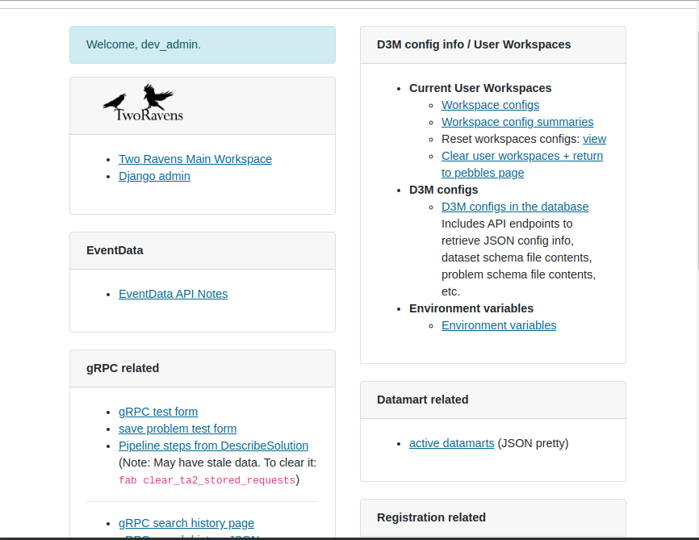
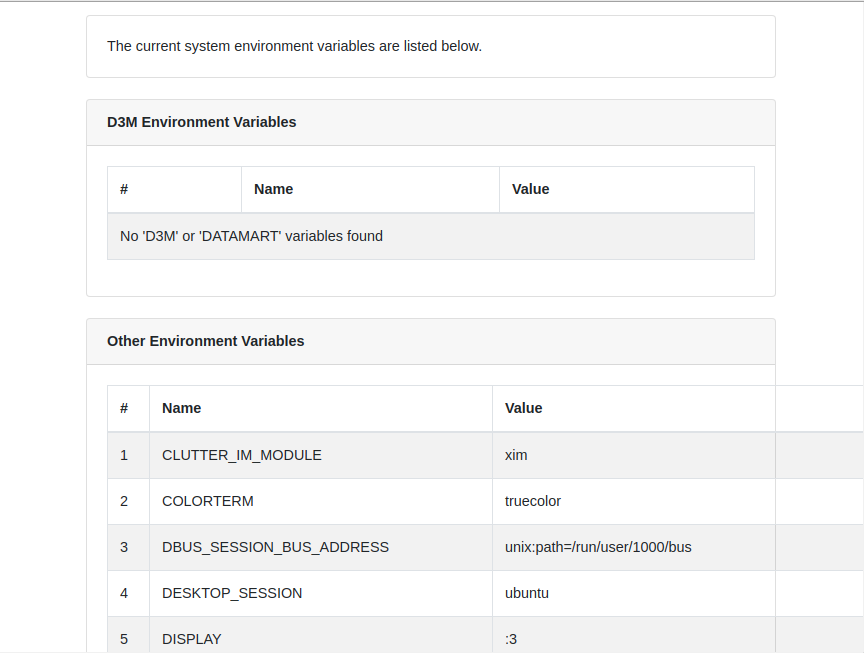
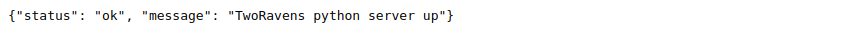
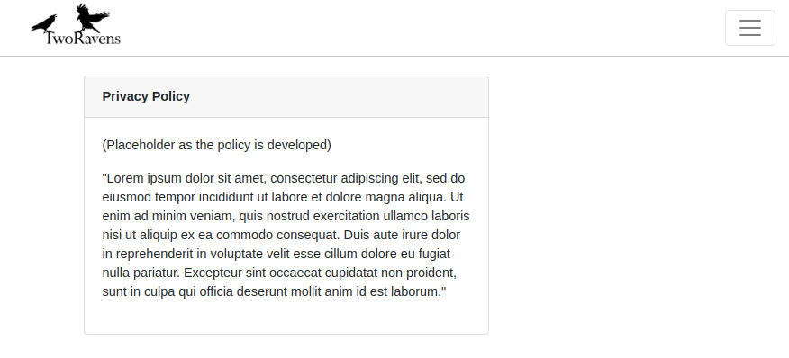
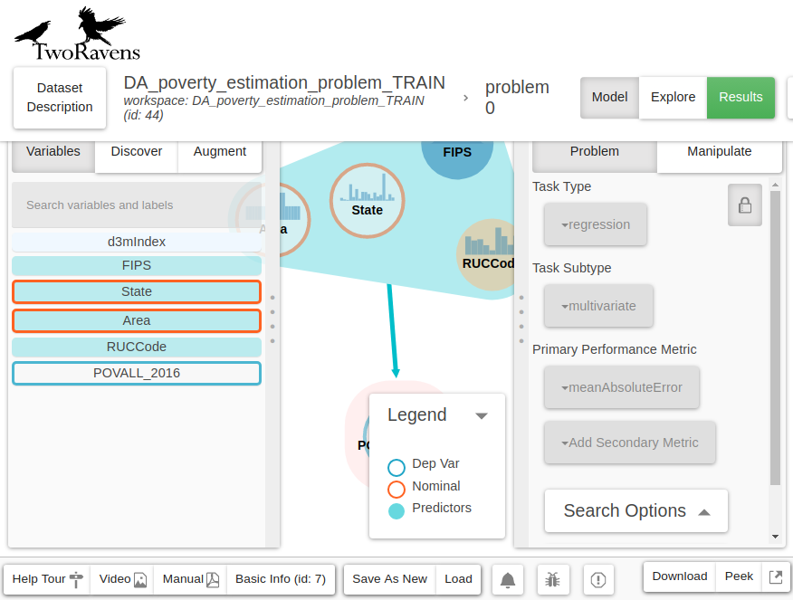

D3M Content Page
=================

This web application constructs the web page you can see. Different pages will be rendered based on the url received.
Generally, it controls the website rendering process.

URL Patterns
============

All acceptable url patterns (in regex) are presented below:
* [dev_raven_links](#dev_raven_links)
* [show-env-variables](#show_env_variables)
* [monitoring/alive](#monitoring)
* [privacy-policy](#privacy_policy)
* [app-domain-config-error](#app_domain_config_error)
* [d3m-configuration-error](#d3m_config_error)
* [(empty pattern | default page)](#default)

---

**Pattern**: dev_raven_links 

&nbsp;&nbsp;&nbsp;&nbsp;&nbsp;&nbsp;Return a development information web page.

* **view_dev_raven_links** (request)

* **Parameters**:
    * **request** (*Django.http.HttpRequest*):  Http request received, it's naturally handled by Django framework.

* **Example**:

---

**Pattern**: show-env-variables 

&nbsp;&nbsp;&nbsp;&nbsp;&nbsp;&nbsp;Return a HTML contains a list of ENV settings.

* **view_env_variables** (request)

* **Parameters**:
    * **request** (*Django.http.HttpRequest*):  Http request received, it's naturally handled by Django framework.

* **Example**:

---

**Pattern**: monitoring/alive 

&nbsp;&nbsp;&nbsp;&nbsp;&nbsp;&nbsp;Return a JSON string that indicates the status of kubernetes

* **view_monitoring_alive** (request)

* **Parameters**:
    * **request** (*Django.http.HttpRequest*):  Http request received, it's naturally handled by Django framework.

* **Example**:

---

**Pattern**: privacy-policy 

&nbsp;&nbsp;&nbsp;&nbsp;&nbsp;&nbsp;Return a HTML page contains the privacy policy.

* **view_privacy_policy** (request)

* **Parameters**:
    * **request** (*Django.http.HttpRequest*):  Http request received, it's naturally handled by Django framework.

* **Example**:

---

**Pattern**:app-domain-config-error 

&nbsp;&nbsp;&nbsp;&nbsp;&nbsp;&nbsp;Return a pop-up shows no domain config error.

* **view_no_domain_config_error** (request, is_test_page=False)

* **Parameters**:
    * **request** (*Django.http.HttpRequest*):  Http request received, it's naturally handled by Django framework.
    * **is_test_page** (*Boolean*) a flag works for test page. Ignore.

* **Example**:

None

---

**Pattern**: d3m-configuration-error 

&nbsp;&nbsp;&nbsp;&nbsp;&nbsp;&nbsp;Return a pop-up shows no D3M config error.

* **view_d3m_config_error** (request)

* **Parameters**:
    * **request** (*Django.http.HttpRequest*):  Http request received, it's naturally handled by Django framework.

* **Example**:

None

---

**Pattern**: '' 

&nbsp;&nbsp;&nbsp;&nbsp;&nbsp;&nbsp;Serve up the workspace, the current home page. Include global js settings.

* **view_pebbles_home** (request)

* **Parameters**:
    * **request** (*Django.http.HttpRequest*):  Http request received, it's naturally handled by Django framework.

* **Example**:

