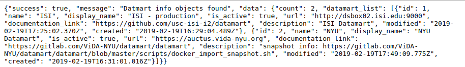

Datamart Endpoint
=================

This application is a core component of our D3M interface. Namely, it handles the communication between remote Datamart server and process the response It will generate url based on your operation and pass it to the **View** component.
After that, **View** will execute corresponding logic code based on the input urls.

URL Patterns
============

All acceptable url patterns (in regex) are presented below:
* [api/datamart-info](#api_datamart_info)
* [api/get-metadata](#api_get_metadata)
* [api/scrape](#api_scrape)
* [api/index](#api_index)
* [api/search](#api_search)
* [api/search-by-dataset](#api_search_by_dataset)
* [api/api-materialize-async](#api_materialize_async)
* [api/augment](#api_augment)

where '?' denotes optional extra pattern, please refer to corresponding section for detailed information.

---

**Pattern**: api/datamart-info 

&nbsp;&nbsp;&nbsp;&nbsp;&nbsp;&nbsp;Return a JSON string that contains detailed information of current status of connected datamart server.

* **api_datamart_info** (request)

* **Parameters**:
    * **request** (*Django.http.HttpRequest*):  Http request received, it's naturally handled by Django framework.

* **Example**:

---

**Pattern**: api/get-metadata 

&nbsp;&nbsp;&nbsp;&nbsp;&nbsp;&nbsp;Return a JSON string that contains the metadata of the requested dataset.

* **api_get_metadata** (request)

* **Parameters**:
    * **request** (*Django.http.HttpRequest*):  Http request received, it's naturally handled by Django framework. It should have a request body that contains dataset information.

* **Example**:

N/A

---

**Pattern**: api/scrape 

&nbsp;&nbsp;&nbsp;&nbsp;&nbsp;&nbsp;Return a JSON string that contains the datamart scrape form of the requested dataset.

* **api_scrape** (request)

* **Parameters**:
    * **request** (*Django.http.HttpRequest*):  Http request received, it's naturally handled by Django framework. It should have a request body that contains dataset information.

* **Example**:

N/A

---

**Pattern**: api/index 

&nbsp;&nbsp;&nbsp;&nbsp;&nbsp;&nbsp;Return a JSON string that contains the datamart index form of the requested dataset.

* **api_index** (request)

* **Parameters**:
    * **request** (*Django.http.HttpRequest*):  Http request received, it's naturally handled by Django framework. It should have a request body that contains dataset information.

* **Example**:

N/A

---

**Pattern**: api/search 

&nbsp;&nbsp;&nbsp;&nbsp;&nbsp;&nbsp;Return a JSON string that contains the search result of the requested dataset. Search the datamart with a JSON request.  The 'source' will determine which datamart to search

* **api_search** (request)

* **Parameters**:
    * **request** (*Django.http.HttpRequest*):  Http request received, it's naturally handled by Django framework.

* **Example**:

N/A

---

**Pattern**: api/search_by_dataset 

&nbsp;&nbsp;&nbsp;&nbsp;&nbsp;&nbsp;Return a JSON string that contains the search result of the requested dataset.

* **api_search_by_dataset** (request)

* **Parameters**:
    * **request** (*Django.http.HttpRequest*):  Http request received, it's naturally handled by Django framework.

* **Example**:

N/A

---

**Pattern**: api/materialize-async 

&nbsp;&nbsp;&nbsp;&nbsp;&nbsp;&nbsp;Return a JSON string that contains the result of running async materialize with ISI, which is asked by this request.

* **api_materialize_async** (request)

* **Parameters**:
    * **request** (*Django.http.HttpRequest*):  Http request received, it's naturally handled by Django framework.

* **Example**:

N/A

---

**Pattern**: api/augment 

&nbsp;&nbsp;&nbsp;&nbsp;&nbsp;&nbsp;Return a JSON string that contains the result of running steps of augment (such as create new dataset folder structure, etc), which is asked by this request.

* **api_augment_async** (request)

* **Parameters**:
    * **request** (*Django.http.HttpRequest*):  Http request received, it's naturally handled by Django framework.

* **Example**:

N/A

---