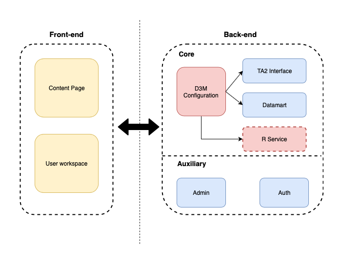

TwoRavens Machine Learning Interface
=======================

Generally, our TwoRavens Machine Learning Interface consists of two main components: Front-end and Back-end. Each contains several web applications.
This documentation provides a simple yet complete tutorial for the user and a detailed API introduction for the programmer.
Our TwoRavens Machine Learning interface is built upon Django and we assume the user know the basic of Django, please refer to [Django](https://www.djangoproject.com/) for more information about this framework.

# Table of Contents
* Tutorial and User Guide
    * [External Link](http://2ra.vn/assets/files/tworavens-d3mguide.pdf)
* API Documentation (Web Application)
    * [Overview](api_docs/overview.md)
    * [Content_pages](api_docs/content_pages/index.md)
    * [D3M Configuration](api_docs/configuration/index.md)
    * [TA2 Interface](api_docs/ta2/index.md)
    * [Datamart](api_docs/datamart/index.md)

# Additional Resource

The TwoRavens for Machine Learning application has been built as part of the [Data Driven Discovery of Models](https://www.darpa.mil/program/data-driven-discovery-of-models) (D3M) program. Please refer to this [Gitlab](https://gitlab.com/datadrivendiscovery/ta3ta2-api) for more information about the API and the json schema we use for communication.

Component Architecture
=======================

Above is the architecture of our D3M Interface. The function of each component is listed below:

* **Front-end**
    * **Content Pages** : Render the web page presented to user;
    * **User Workspace** : Render the user workspace in each web page;
* **Back-end**
    * **D3M Configuration** : (*Core Component*) Contains all the information of a D3M task;
    * **R Service** : Handle the dataset pre-process using R. (We are using *flask* as wrapper now). Notably, this component is only used by D3M Configuration, thus it can be considered as part of it.
    * **TA2 Interface** : (*Core Component*) Handle the communication with remote TA2 Server;
    * **Datamart** : (*Core Component*) Handle the communication with remote data repo and provide dataset filtering;
    * **Auth** : Handles the user login/logout procedure;
    * **Admin**: Default application provided by Django framework, provides an user-friendly control panel for the webpage;
