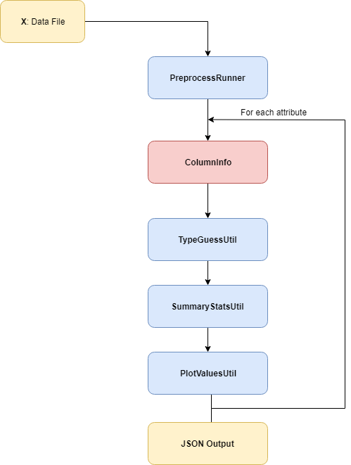

API Documentation
=================

This document describes the detailed information of the API we provided.

Overview
--------

Below is the workflow graph of the analysis process. We will introduce the component one by one. In this page, only the basic usage of each component will be presented, please refer to corresponding linked page for advanced usage.



PreprocessRunner
----------------

PreprocessRunner is the most fundamental component in our server. It handles the input data frame, stores the task configuration
and executes the actual variable analysis function. There are two ways to initialize a *PreprocessRunner*, one is by calling the static function *load_from_file*():

``` python3

    from preprocess_runner import PreprocessRunner
    from msg_util import msg, msgt
    ...
    runner, err_msg = PreprocessRunner.load_from_file(in_file, out_file)
    # in_file & out_file is the path of corresponding file
    # out_file is None by default
    if err_msg:
        msgt(err_msg)
        return

    runner.show_final_info()
```

Other one is more straightforward:

```python3

    from preprocess_runner import PreprocessRunner
    import pandas as pd
    ...
    runner = PreprocessRunner(dataframe)
    # dataframe is a Pandas.Dataframe, you can create such entity by yourself.
    runner.run_preprocess()
    runner.show_final_info()
    ...
```

Please refer to [PreprocessRunner](preprocess_runner.md) for advanced usage.

ColumnInfo
----------

*ColumnInfo* stores all the information required to describe a variable. For example, *variable_name*, *variable_type* etc.
You can instantiate a *ColumnInfo* via following code. However, in most cases, the ColumnInfo will be generated by *PreprocessRunner*

``` python3

    from column_info import ColumnInfo
    ...
    new_column = ColumnInfo(colname)
    # colname is just a string represents the name of the variable
    ...
```

Please refer to [ColumnInfo](column_info.md) for advanced usage.

TypeGuessUtil
-------------

*TypeGuessUtil* is the first Utility object we used during profiling process. It has several useful function to help you check the data type of current variable.
Below is the code to instantiate a *TypeGuessUtil* object and use it to check the type of input column.

```python3

    from type_guess_util import TypeGuessUtil
    from column_info import ColumnInfo
    import pandas as pd
    ...
    col_info = ColumnInfo(colname)
    col_series = dataframe[colname]
    # 'dataframe' is the input Pandas.Dataframe and 'colname' is an available column name.

    new_util = TypeGuessUtil(col_series, col_info)
    # All the information about data type will be stored in this 'new_util'
    ...
```

Please refer to [TypeGuessUtil](type_guess_util.md) for advanced usage.

SummaryStateUtil
----------------

Please refer to :ref:`SummaryStateUtil` for advanced usage.

PlotValueUtil
-------------

Please refer to :ref:`PlotValueUtil` for advanced usage.

* :ref:`test_ref`