# TA3-TA2 API

This repository contains a TA3-TA2 API protocol specification and implementation using
[GRPC](http://grpc.io/).
The API allows a TA3 to request from TA2 to start a pipeline search process, using
an optional pipeline template, and after candidate pipelines are found a TA3
can request scoring, fitting, or producing data through a pipeline.

The GRPC protocol specification can be automatically compiled into implementations
for multiple programming languages.
See below for more information and the [Quickstart](http://grpc.io/docs/quickstart/) for details
about GRPC.

## API Structure

TA3-TA2 API calls are defined in the *core* GRPC service which can be found in [`core.proto`](./core.proto) file
and all TA3 and TA2 sytems are expected to implement it and support it. Optional services can be
defined as well in other `.proto` files.

Useful utilities for working with the TA3-TA2 API in Python are available in the included [ta3ta2_api](https://gitlab.com/datadrivendiscovery/ta3ta2-api/tree/dist-python) package.


## GRPC compilation

GRPC provides tooling to compile protocol specification into various target languages. Examples follow.

### Go setup

To set up GRPC and Protocol Buffers in Go run:

```
go get -u github.com/golang/protobuf/proto
go get -u github.com/golang/protobuf/protoc-gen-go
go get -u google.golang.org/grpc
```
Next install protocol buffer compiler:

Linux

```bash
curl -OL https://github.com/google/protobuf/releases/download/v3.3.0/protoc-3.3.0-linux-x86_64.zip
unzip protoc-3.3.0-linux-x86_64.zip -d protoc3
sudo cp protoc3/bin/protoc /usr/bin/protoc
sudo cp -r protoc3/include /usr/local
```

OSX

```bash
curl -OL https://github.com/google/protobuf/releases/download/v3.3.0/protoc-3.3.0-osx-x86_64.zip
unzip protoc-3.3.0-osx-x86_64.zip -d protoc3
sudo cp protoc3/bin/protoc /usr/bin/protoc
sudo cp -r protoc3/include /usr/local
```

Compile the `.proto` file:

```
protoc -I /usr/local/include -I . core.proto --go_out=plugins=grpc:.
```

The resulting `core.pb.go` file implements the messaging protocol, client and server.

### Python setup

Install libraries and tools via pip:

```
python -m pip install grpcio --ignore-installed
python -m pip install grpcio-tools
```

Compile the `.proto` file:

```
python -m grpc_tools.protoc -I . --python_out=. --grpc_python_out=. core.proto
```

The created `core_pb2.py` file implements the messaging protocol, and `core_pb2_grpc.py` implements the client and server.

### Javascript/Node.js setup

Use `npm` to get GRPC and Protocol Buffer packages:

```
npm install grpc
npm install google-protobuf
```

Just as with Go installation, need to install protocol buffer compiler:

Linux

```bash
curl -OL https://github.com/google/protobuf/releases/download/v3.3.0/protoc-3.3.0-linux-x86_64.zip
unzip protoc-3.3.0-linux-x86_64.zip -d protoc3
sudo mv protoc3/bin/protoc /usr/bin/protoc
sudo cp -r protoc3/include /usr/local
```

OSX

```bash
curl -OL https://github.com/google/protobuf/releases/download/v3.3.0/protoc-3.3.0-osx-x86_64.zip
unzip protoc-3.3.0-osx-x86_64.zip -d protoc3
sudo mv protoc3/bin/protoc /usr/bin/protoc
sudo cp -r protoc3/include /usr/local
```

Compile the `.proto` file:

```
protoc -I /usr/local/include -I . core.proto --js_out=import_style=commonjs,binary:.
```

The resulting `core_pb.js` file implements the messaging protocol, client and server.

## Pipelines

API is centered around a concept of a pipeline. Pipelines are described using a shared
[D3M pipeline language](https://gitlab.com/datadrivendiscovery/metalearning). Pipeline
descriptions are used in two places:

* To describe a pipeline template provided by a TA3 to a TA2.
* To describe resulting pipelines TA2 finds back to TA3.

Generally, pipelines always have Dataset container value as input (currently only
one) and predictions as output. This is the only pipeline TA2 is expected to search.
But TA3 can fully specify any pipeline for TA2 to execute without any search
(including a pipeline of just one primitive).

Examples of "relaxations" of the common requirements are included. We expect
that some TA2 systems will be able to work with those relaxed requirements,
and TA3s can use those if available, but it is not expected that every TA2
will. TA3s should be able to function within the restrictions as stated below.

### Pipeline templates

Pipeline templates are based on pipeline description with few differences:

* Templates can accept *multiple* Dataset container values as inputs.
* There is a special *placeholder pipeline step* which signals where in the pipeline
  template a TA2 system should insert a standard pipeline it finds.
* Not all fields in the pipeline description are reasonable (they will be filled out by TA2).
  Those differences are explained through comments in the [`pipeline.proto`](./pipeline.proto).

A placeholder pipeline step is replaced with a sub-pipeline during pipeline search to form
final pipeline.

### Pipeline template restrictions

While the pipeline template language does not restrict the use of a placeholder step, for
the purpose of TA3-TA2 API we are currently placing the following restrictions:

* There can be only one placeholder step in a pipeline template, at the top-level of a pipeline (not inside a sub-pipeline).
* The placeholder step has to have only one input, a Dataset container value, and one output,
  predictions as a Pandas dataframe. In this way it resembles a standard pipeline.
* The placeholder can be only the last step in the pipeline.
* All primitive steps should have all their hyper-parameters fixed.

These restrictions effectively mean that a pipeline template can only specify a directed acyclic graph of preprocessing 
primitives that transforms one or more input Dataset container values into a *single* transformed
Dataset container value, which is the input to the placeholder step (and future sub-pipeline in its place).
There are no additional restrictions on the types of individual primitives that can be used within the 
pipeline template, although impact on downstream TA2 processing should be assessed before a given 
primitive is used.

Relaxation: Individual systems can relax those restrictions. For example, they might allow
a placeholder step to have postprocessing primitive steps after it. In this case postprocessing
primitives can only transform predictions from a placeholder step into transformed predictions.
Or individual systems might allow primitve steps to have free hyper-parameters a TA2 system
should tune.

### Fully specified pipelines

TA3 can also provide a fully specified pipeline in the `SearchSolutions`. This is a pipeline description
which does not have any placeholder step and have all hyper-parameters fixed.

For fully specified pipelines with fixed hyper-parameters, TA2 will just check that the given
pipeline is valid and return it for it to be directly executed (scored, fitted, called to
produce data). This allows fixed computations to be done on data, for example, the pipeline
can consist of only one primitive with fixed hyper-parameters to execute that one primitive.
Moreover, such fully specified pipelines with fixed hyper-parameters can have any
inputs and any outputs. (Standard pipelines are from a Dataset container value
to predictions Pandas dataframe.) When non-Dataset inputs are provided, TA2 should attempt
to convert input value to closest container type value, e.g., GRPC `RAW` list value should
be converted to `d3m.container.List` with generated metadata, CSV file read as Pandas
DataFrame should be converted to `d3m.container.DataFrame` with generated metadata.

Relaxation: Individual systems can support also pipelines with all primitives specified,
but with free (available for tuning) hyper-parameters. In this case, TA2 will only tune
hyper-parameters and resulting pipelines will have the same structure as given pipeline,
but hyper-parameter configuration will differ.

## Values

Some messages contain data values which can be passed between TA2 and TA3. There are
multiple ways those values can be passed and they are listed in the [`value.proto`](./value.proto)
file:

* Put simple raw values directly in the message.
* If a value is a Dataset container value, read or write it through a dataset URI.
* Value can also be Python-pickled and stored at a URI or given directly in the message.
* If value is a tabular container value, it can also be stored as a CSV file.
* Value can be stored into a shared [Plasma store](https://arrow.apache.org/docs/python/plasma.html),
  in which case value is represented by its Plasma ObjectID.

Because not all systems can or are willing to support all ways to pass the value, and we can
extend them in the future, API supports signaling between TA2 and TA3 which value types are
allowed/supported through `Hello` call.

## Example call flows

### Basic pipeline search

Below is an example call flow in which a TA3 system initiates a pipeline search request without any
preprocessing or postprocessing, and the TA2 system returns two pipelines through a series of streamed
responses. Responses for multiple pipelines are transmitted each using one GRPC stream and can be
interleaved. Client then requests scores for one.

```mermaid
sequenceDiagram
  participant Client
  participant ScoreSolution
  participant SearchSolutions
  Client->>SearchSolutions: SearchSolutionsRequest
  SearchSolutions-->>Client: SearchSolutionsResponse { search_id = 057cf5... }
  Client->>+SearchSolutions: GetSearchSolutionsResults(GetSearchSolutionsResultsRequest)
  SearchSolutions-->>Client: GetSearchSolutionsResultsResponse { solution_id = a5d78d... }
  SearchSolutions-->>Client: GetSearchSolutionsResultsResponse { solution_id = b6d5e2... }
  Client->>ScoreSolution: ScoreSolutionRequest { a5d78d... }
  ScoreSolution-->>Client: ScoreSolutionResponse { request_id = 1d9193... }
  Client->>+ScoreSolution: GetScoreSolutionResults(GetScoreSolutionResultsRequest)
  ScoreSolution-->>Client: ScoreSolutionResultsResponse { progress = PENDING }
  ScoreSolution-->>Client: ScoreSolutionResultsResponse { progress = RUNNING }
  ScoreSolution-->>Client: ScoreSolutionResultsResponse { progress = COMPLETED, scores }
  ScoreSolution-->>-Client: (ScoreSolution stream ends)
  Client->>SearchSolutions: EndSearchSolutions(EndSearchSolutionsRequest)
  SearchSolutions-->>Client: EndSearchSolutionsResponse
  SearchSolutions-->>-Client: (GetFoundSolutions stream ends)
```



```
1. Client: SearchSolutions(SearchSolutionsRequest) // problem = {...}, template = {...}, inputs = [dataset_uri]
2. Server: SearchSolutionsResponse // search_id = 057cf581-5d5e-48b2-8867-db72e7d1381d
3. Client: GetSearchSolutionsResults(GetSearchSolutionsResultsRequest) // search_id = 057cf581-5d5e-48b2-8867-db72e7d1381d
[SEARCH SOLUTIONS STREAM BEGINS]
4. Server: GetSearchSolutionsResultsResponse // progress = PENDING
5. Server: GetSearchSolutionsResultsResponse // progress = RUNNING, solution_id = 5b08f87a-8393-4fa4-95be-91a3e587fe54, internal_score = 0.6, done_ticks = 0.5, all_ticks = 1.0
6. Server: GetSearchSolutionsResultsResponse // progress = RUNNING, solution_id = 95de692f-ea81-4e7a-bef3-c01f18281bc0, internal_score = 0.8, done_ticks = 1.0, all_ticks = 1.0
7. Server: GetSearchSolutionsResultsResponse // progress = COMPLETED
[SEARCH SOLUTIONS STREAM ENDS]
8. Client: ScoreSolution(ScoreSolutionRequest) // solution_id = 95de692f-ea81-4e7a-bef3-c01f18281bc0, inputs = [dataset_uri], performance_metrics = [ACCURACY]
9. Server: ScoreSolutionResponse // request_id = 5d919354-4bd3-4155-9295-406d8c02b915
10. Client: GetScoreSolutionResults(GetScoreSolutionResultsRequest) // request_id = 5d919354-4bd3-4155-9295-406d8c02b915
[SCORE SOLUTION STREAM BEGINS]
11. Server: GetScoreSolutionResultsResponse // progress = PENDING
12. Server: GetScoreSolutionResultsResponse // progress = RUNNING
13. Server: GetScoreSolutionResultsResponse // progress = COMPLETED, scores = [0.9]
[SCORE SOLUTION STREAM END]
14. Client: EndSearchSolutions(EndSearchSolutionsRequest) // search_id = 057cf581-5d5e-48b2-8867-db72e7d1381d
15. Server: EndSearchSolutionsResponse
```

### Pass-through execution of a primitive

Example call flow for a TA3 system calling one primitive on a dataset and storing transformed dataset into a
Plasma store where it can efficiently access it using memory sharing and display it to the user.
Even if the primitive is just a transformation and fitting is not necessary, TA3 has to fit a solution
before it is able to call produce.

This example has as an input dataset and as the output dataset as well. This is different from regular
pipelines which take dataset as input and produce predictions as output. The reason is that the
pipeline is full specified by a TA3 system so inputs and outputs can be anything.

```
1. Client: SearchSolutions(SearchSolutionsRequest) // problem = {...}, template = {...}, inputs = [dataset_uri]
2. Server: SearchSolutionsResponse // search_id = ae4de7f4-4435-4d86-834b-c183ef85f2d0
3. Client: GetSearchSolutionsResults(GetSearchSolutionsResultsRequest) // search_id = ae4de7f4-4435-4d86-834b-c183ef85f2d0
[SEARCH SOLUTIONS STREAM BEGINS]
4. Server: GetSearchSolutionsResultsResponse // progress = PENDING
5. Server: GetSearchSolutionsResultsResponse // progress = RUNNING, solution_id = 619e09ee-ccf5-4bd2-935d-41094169b0c5, internal_score = NaN, done_ticks = 1.0, all_ticks = 1.0
6. Server: GetSearchSolutionsResultsResponse // progress = COMPLETED
[SEARCH SOLUTIONS STREAM ENDS]
7. Client: FitSolution(FitSolutionRequest) // solution_id = 619e09ee-ccf5-4bd2-935d-41094169b0c5, inputs = [dataset_uri]
8. Server: FitSolutionResponse // request_id = e7fe4ef7-8b3a-4365-9fc4-c1a8228c509c
9. Client: GetFitSolutionResults(GetFitSolutionResultsRequest) // request_id = e7fe4ef7-8b3a-4365-9fc4-c1a8228c509c
[FIT SOLUTION STREAM BEGINS]
10. Server: GetFitSolutionResultsResponse // progress = PENDING
11. Server: GetFitSolutionResultsResponse // progress = RUNNING
12. Server: GetFitSolutionResultsResponse // progress = COMPLETED, fitted_solution_id = 88d627a4-e4ca-4b1a-9f2e-af9c54dfa860
[FIT SOLUTION STREAM END]
13. Client: ProduceSolution(ProduceSolutionRequest) // fitted_solution_id = 88d627a4-e4ca-4b1a-9f2e-af9c54dfa860, inputs = [dataset_uri], expose_outputs = ["outputs.0"], expose_value_types = [PLASMA_ID]
14. Server: ProduceSolutionResponse // request_id = 954b19cc-13d4-4c2a-a98f-8c15498014ac
15. Client: GetProduceSolutionResults(GetProduceSolutionResultsRequest) // request_id = 954b19cc-13d4-4c2a-a98f-8c15498014ac
[PRODUCE SOLUTION STREAM BEGINS]
16. Server: GetProduceSolutionResultsResponse // progress = PENDING
17. Server: GetProduceSolutionResultsResponse // progress = RUNNING, steps = [progress = PENDING]
18. Server: GetProduceSolutionResultsResponse // progress = RUNNING, steps = [progress = RUNNING]
19. Server: GetProduceSolutionResultsResponse // progress = RUNNING, steps = [progress = COMPLETED]
20. Server: GetProduceSolutionResultsResponse // progress = COMPLETED, steps = [progress = COMPLETED], exposed_outputs = {"outputs.0": ObjectID(6811fc1154520d677d58b01a51b47036d5a408a8)}
[PRODUCE SOLUTION STREAM END]
21. Client: EndSearchSolutions(EndSearchSolutionsRequest) // search_id = ae4de7f4-4435-4d86-834b-c183ef85f2d0
22. Server: EndSearchSolutionsResponse
```

`template` used above could look like (with message shown in JSON):

```json
{
  "inputs": [
    {
      "name": "dataset"
    }
  ],
  "outputs": [
    {
      "name": "dataset",
      "data": "step.0.produce"
    }
  ],
  "steps": [
    {
      "primitive": {
        "id": "f5c2f905-b694-4cf9-b8c3-7cd7cf8d6acf"
      },
      "arguments": {
        "inputs": {
          "data": "inputs.0"
        }
      },
      "outputs": [
        {
          "id": "produce"
        }
      ]
    }
  ]
}
```

## Standard port

A standard port for TA2-TA3 API on which TA2 should listen for connections from a TA3 is 45042.

## Protocol version

To support easier debugging `SearchSolutionsRequest` and `SearchSolutionsResponse` messages contain a version of the protocol
used by each party. This can serve to easier understand a potential problem by detecting a version mismatch.

For this to work, `version` field has to be populated from the value stored in the protocol specification itself.
We use [custom options](https://developers.google.com/protocol-buffers/docs/proto#customoptions) for this.
To retrieve the version from the protocol specification, you can do the following in Python:

```python
import core_pb2
version = core_pb2.DESCRIPTOR.GetOptions().Extensions[core_pb2.protocol_version]
```

In Go, accessing version is slightly more involved and it is described
[here](https://gitlab.com/datadrivendiscovery/ta3ta2-api/snippets/1684616).

## Extensions of messages

GRPC and Protocol Buffers support a simple method of extending messages: just define extra fields with custom tags
in your local version of the protocol. Performers can do that to experiment with variations of the protocol (and if
changes work out, they can submit a merge request to the common API). To make sure such unofficial fields in messages
do not conflict between performers, use values from the [allocated tag ranges](./private_tag_ranges.txt) for your
organization.

## Changelog

See [HISTORY.md](./HISTORY.md) for summary of changes to the API.

## Repository structure

`master` branch contains latest stable release of the TA3-TA2 API specification.
`devel` branch is a staging branch for the next release.

Releases are [tagged](https://gitlab.com/datadrivendiscovery/ta3ta2-api/tags).

At every commit to `master` and `devel` branches we compile `.proto` files and push
compiled files to `dist-*` and `dev-dist-*` branches for multiple languages. You can use those
branches in your projects directly using `git submodule` or some other similar mechanism.

## Contributing

See [contributing guide](./CONTRIBUTING.md) for more information how to contribute to the API development.

## About Data Driven Discovery Program

DARPA Data Driven Discovery (D3M) Program is researching ways to get machines to build
machine learning pipelines automatically. It is split into three layers:
TA1 (primitives), TA2 (systems which combine primitives automatically into pipelines
and executes them), and TA3 (end-users interfaces).
